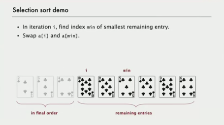
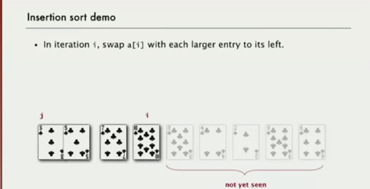
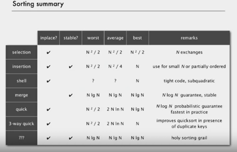

A cheat sheet or a learning material for those who have just started to practice things with data structures.

Covered data structures will be listed accordingly. For now:

* Binary Tree
* Binary Search Tree
* Stack
* Deque

Some of the sources that are used:
http://cslibrary.stanford.edu/110/BinaryTrees.html

**SORT ALGORITHMS** in class SortLibrary:

* **BASIC SORT ALGORITHMS**

  * **SELECTION SORT**  time complexiy: O(N^2)

  
  * **INSERTION SORT**  time complexiy: O(N^2)
    * If the array is partially sorted it runs on linear time O(N)

      
  * **SHELL SORT** time complexiy: O(N^3/2) - in practice it is much less, but not proved
  Nearly same as insertion sort but;
  (the idea: move entries more than 1 position at a time by h-sorting the array)

* **ADVANCED SORT ALGORITHMS**
  * **MERGE SORT**  O(N LOGN)
  * **QUICK SORT**  O(N LOGN)
  

**SELECTION ALGORITHMS**

Selecting sort algorithm criteria cheat sheet:

Applications can have diverse attributes:
* Stable?
* Parallel?
* Deterministic?
* Keys all distinct?
* Multiple key types?
* Linked list or arrays?
* Large or small items?
* Is your array randomly ordered?
* Need guaranteed performance?

